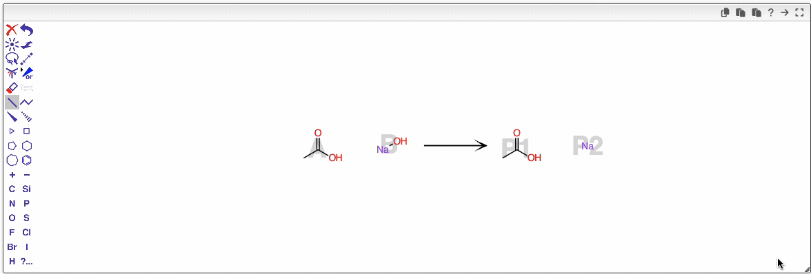
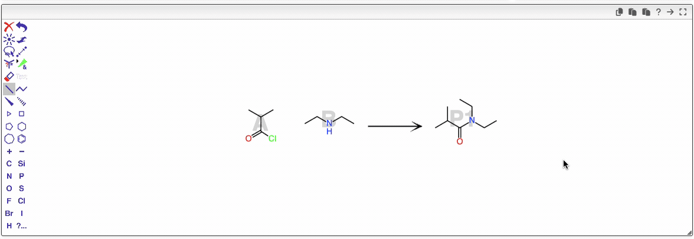

# Migration to the New OpenChemLib Reaction Editor

The previous JSME editor, which served us for the past 10 years, had several limitations that were challenging to resolve. These included the inability to edit large reactions, difficulties handling enhanced stereochemistry and zero-order bonds, and problems with correctly encoding salts.

To address these issues, we have now migrated to the new OpenChemLib reaction editor. This editor is designed to overcome all the aforementioned limitations and provide a more robust and flexible editing experience. While we strive to maintain all existing functionalities, some minor differences remain—particularly in the use of keyboard shortcuts. It is highly recommended to familiarize yourself with the shortcuts available in the OpenChemLib [reaction editor](/eln/uuid/ocl-editor) to work efficiently.

## Adding Structures from the Reagents Tables

As before, it is possible to enter the structure of commercial products or previously synthesized reagents by clicking on the hexagon icon.

Most of the time, the products are structurally close to one of the reagents. To duplicate a reagent, click on the new arrow icon in the toolbar. A popup window will appear, allowing you to select which reagent you would like to duplicate.

Using shortcuts, it is now fast to apply changes and draw the product of the reaction.

## Dealing with Salts

If you create a salt, you can draw the two ions separately. Depending on their relative positions, they will appear either as one or two products. Simply place the ions close to each other so they are combined as a single product.

## Zoom In / Out and Rotate

On the canvas, press <kbd>z</kbd> to select the zoom tool (or click the corresponding icon in the toolbar).

- Moving the cursor vertically while pressing will zoom in or out.
- Moving the cursor horizontally while pressing will rotate the selected molecules.

To select a specific molecule, press <kbd>space</kbd> while your cursor is over the canvas or click the lasso icon. Clicking anywhere else on the canvas will deselect all, and zoom/rotate will apply to the entire canvas. Double-clicking an atom selects the entire molecule, so rotation will apply only to that molecule.

Just save the reaction in order to realign the reagents and products.

## Enhancing Stereochemistry

In some cases, you may create many stereocenters that have known relationships. For example, the addition of bromine on an olefin creates such relationships.

The editor allows you to define groups of stereocenters and specify if both configurations apply ('&'), or only one of them. If only one configuration exists, you can specify whether it is known absolutely ('abs') or if it could be either one ('or').

