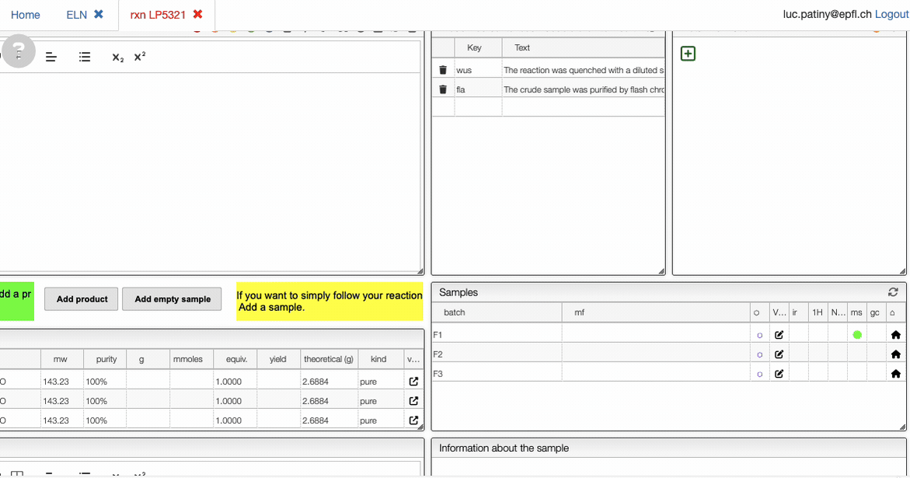
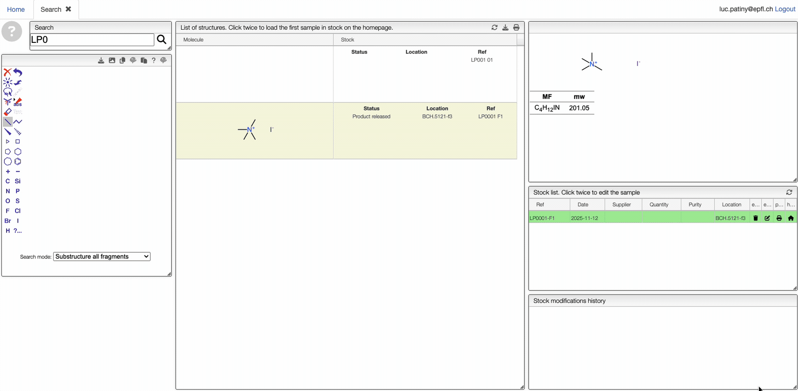

# Reactions

Based on user feedback, several improvements have been implemented in the ELN procedure page.

## Copy Reactant or Product

A new icon has been added to the reaction editor, allowing you to copy any reactant or product as a molfile V3000.

## Check Stock Location and Edit Reagents

When adding reagents to a reaction, the system now displays the storage location for any samples already present in the stock. You can also directly edit the corresponding sample from the reagent list.

## Set Molfile and Molecular Formula from Sample

For samples created from imported data (such as NMR spectra), it is now possible to assign both the molecular formula and the chemical structure with a single click. You can also open the relevant sample directly in edit mode.

# Edit Sample from Stock

You can now open and edit a sample directly from the stock. Simply double-click on the product entry to access the editing interface.

