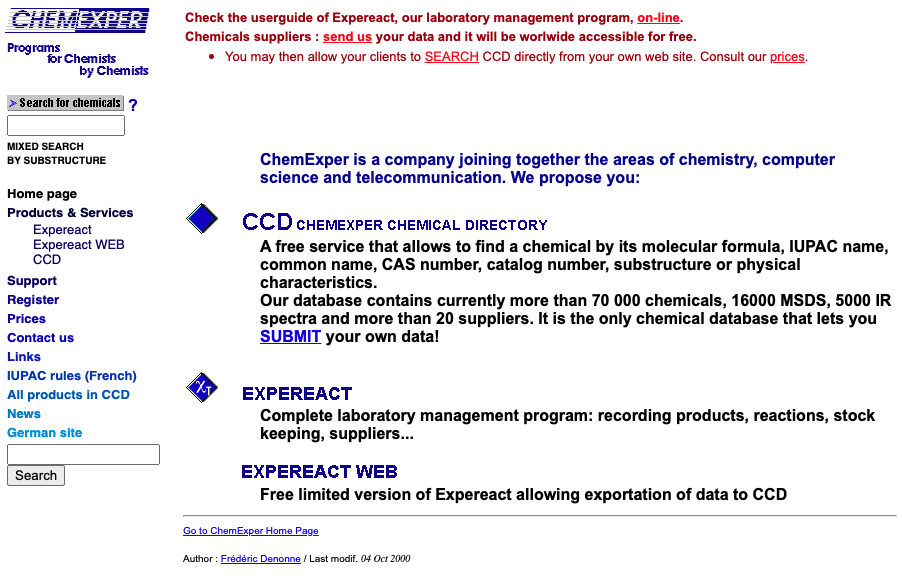
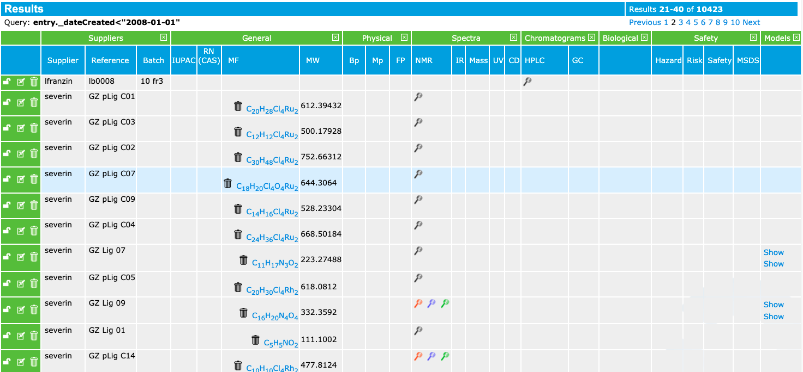

# A brief history

In 1996 Luc Patiny founded a Belgian company, ChemExper sprl, that allowed users to search for free for commercially available chemicals. It provided the first substructure search engine on the internet in which you could draw, thanks to a Java applet, a chemical structure.

This first search engine was built using the `4D` search engine, and at that time even the HTTP server had to be developed using direct access to a TCP library. In 2000, we also [published](sharing-products.pdf) in a journal that has since disappeared a way to share spectra directly on the internet.

Later this search engine was rewritten from scratch in Java, and since 2005 research data from the Institute of Chemistry of the University of Lausanne have been stored in a MySQL database. At the beginning it was only possible to store mass spectra, NMR spectra, infrared spectra, ultraviolet spectra, circular dichroism, X-ray structures and chromatography data. All the data were converted before importation to the IUPAC-supported format: JCAMP-DX.

On first January 2008 over 10'000 samples were already created in this database.

This project grew, and we quickly reached over 100,000 samples in the database. It was based on one large project that became difficult to maintain and develop. Moreover, we wanted to have the same code in the browser and on the server, and with the disappearance of Java applets this became impossible.

In 2014 a group of 4 people (Norman Pellet, Michaël Zasso, Daniel Kostro and Luc Patiny) started to redesign the full system based on a modular approach. At that time JavaScript was becoming a 'real' language and advanced scientific applications in the browser could be foreseen. This development has led to over 200 open-source scientific libraries that are widely used (over 10,000,000 downloads per week) and exhaustively tested. Those packages are present in the following GitHub organizations:

- https://github.com/cheminfo
- https://github.com/mljs
- https://github.com/image-js
- https://github.com/zakodium-oss

[Up to now, over 120 developers have contributed to those projects!](https://cheminfo.github.io/team)

Based on those basic building blocks, various more advanced projects were achieved. The best-known ones are

- https://demo.scipeaks.com
- https://www.chemcalc.org
- https://www.nmrium.com
- https://www.polycalc.org
- https://cphunter.cheminfo.org
- https://wikipedia.cheminfo.org
- https://www.cheminfo.org (a website with various application prototypes)
