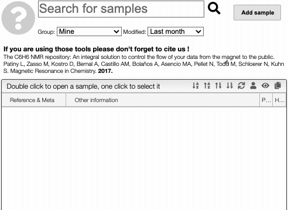

# Search

From the homepage it is possible to quickly find samples using the `Search for sample` query box.

In this box you may simply enter a text and the system will look in the following fields:

>
- **Reference**
- **Names and description**
- **Molecular formula**
- **Keywords**

It is also possible to target a specific field by using as syntax: `<fieldName>:<operator><value>`

:::info

The following fields are allowed:

- `nbNmr`, `nb1d`, `nb2d`, `nb13c`, `nb1h` : number of spectrum registed for NMR, 1d NMR...
- `nbMass`, `nbIR`, `nbTGA`, `nbDSC`, `nbRaman`, `nbMass`, `nbUV`, `nbXray` : number of spectrum registered for IR, Raman ...
- `mf`, `mw`, `em` : molecular formula, molecular weight and exact mass (monoisotpic mass)
- `title` : title of the sample.
- `meta` : meta informations.
- `owner` : name of the owner.
- `modified` : last modification date of the sample.
- `created` : creation date of the sample.
:::

:::tip
The space between search elements is interpreted as an `AND` operator. The operators in the research field can be: `<`, `>` or `=` (= None).
:::

Some examples:

- `nb1d:>0` : all the samples that have at least one 1D NMR spectrum
- `mw:>100 mw:<150` : all samples with molecular weight between 100 and 150
- `jacs` : all the sample that contains `jacs` in any of the fields (reference, names, ...)
- `mf:C10` : all the sample that have a MF that contains `C10` (string search)
- `modified:>2021-04-11 modified:<2021-04-14 owner:justyna`: all samples that are owned by "justyna" and where modified between April, 11 2021 and April, 14 2021

## Filters

You can apply filters in the two dropdown selectors: the first one corresponds to the owner of the sample, you can choose `Mine`, `All` or `Anonymous Read` (used to manipulate product even if not logged in). The second one gives the last modify time: you can choose between the `last month` and the `last 5 years`, or at `any time`.

## Sample panel

In the sample overview panel, you can sort the element by clicking on one of the icon in the menu bar: .

The first three buttons are used for sorting the sample by: `product code`, `reverse product code`, `modification date` or `reverse modification date`. You can also `refresh` the list, see `user informations`, `hide and show samples` and `copy the table of content`. 

## Meta

A product is allowed to have an unlimited number of meta information. Meta information is characterized by a property followed by a value. The name of the property is searchable in the quick search.

For example if you add a meta information having as property 'country' you may search using 'country:colombia'.
