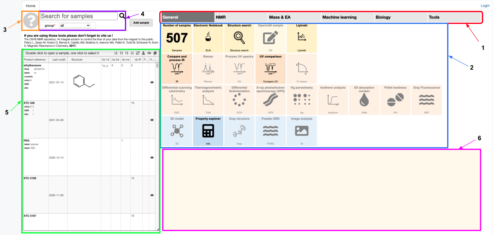

# Getting started with the cheminfo ELN

## Check our videos:

### General overview
<iframe width="675" height="380" src="https://www.youtube.com/embed/SHN07asZaGc" frameborder="0" allow="accelerometer; autoplay; encrypted-media; gyroscope; picture-in-picture" allowfullscreen></iframe>

### Adding new products
<iframe width="675" height="380" src="https://www.youtube.com/embed/4UBwnFCBlvU" frameborder="0" allow="accelerometer; autoplay; encrypted-media; gyroscope; picture-in-picture" allowfullscreen></iframe>

You may think of the cheminfo ELN as either a Laboratory Information Management System or as a repository for your spectroscopic data \(NMR, IR, MS\) with some helpful tools \(e.g. peak-picking, simulation\).

## Overview

The Home page looks like above. The general structure is the following:
 1. Tabs containing different tools you can use
 2. Panel with the tools at your disposal
 3. Help button bringing you to the manual
 4. Sample search panel and group filter
 5. Sample overview panel
 6. Information about selected sample

This platform allows you to organize the information about your samples, including the spectral, physical and chemical data. Furthermore, you can employ various algorithms to test and simulate certain properties, like chemical shifts and Lipinski's criteria. The Electronic Lab Notebook (ELN) allows you to store the protocols of your procedures, maintain information about reactions and efficiently write reports. 

## How to use it

To store your samples you must first log in with your Google account \(upper-right corner\). Public samples are available without login.
You can either create your own sample and have access and edit its information at any time, or search for information about a sample created by a member of a group you belong to. The groups filter the samples according to ownership and allow you to share data with your coworkers only.

Once the sample is created, you may add experimental information, like spectra, and then manipulate it using the available tools.

## Tool set

To the right of the List of selected samples you find the tool set. Clicking on a tool icon will take you to a new tab where you can perform additional tasks (e.g. structure search, structural analysis, 3D modelling). If you wish to find out more, additional information is available further in the manual.

