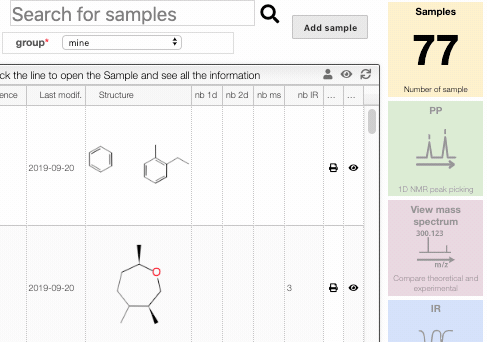

# Hide/Show sample

In order to hide a sample you may click on the `eye` icon on the sample line.

You have the possibility to display all the hidden samples by clicking on the `eye` on the
top of the box. From that list you can then unhide a sample if you need.

