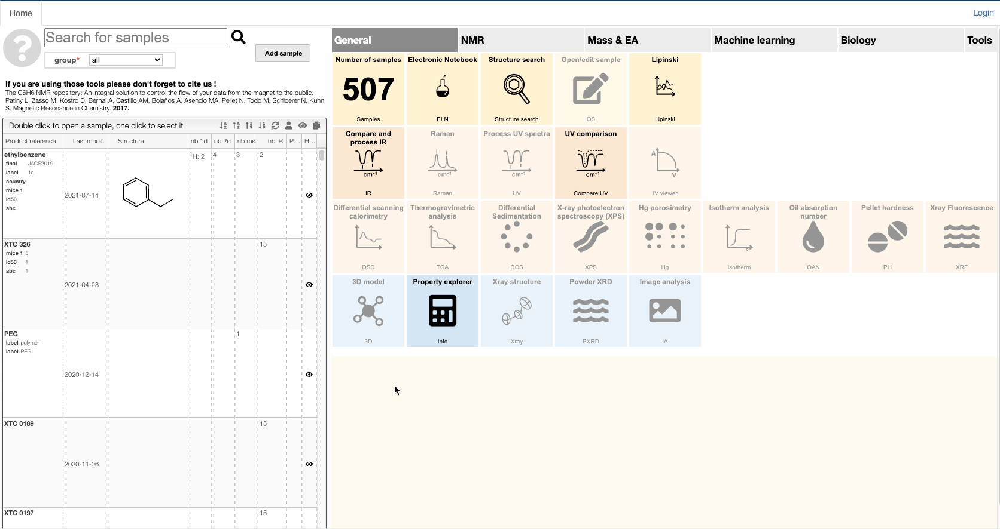
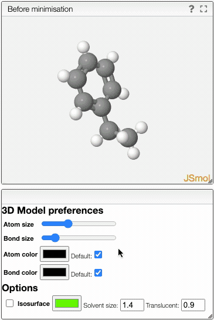

# 3d model

If your sample has a chemical structure it is easy to create a 3D model.

1. Click once on the sample
2. Click on the 3D tile

You can modify the molecule to be visualized by using the panel on the left. If you wish to find out more about how to draw a molecule click on the  button.

You can manipulate the 3D model by adjusting several preferences.

