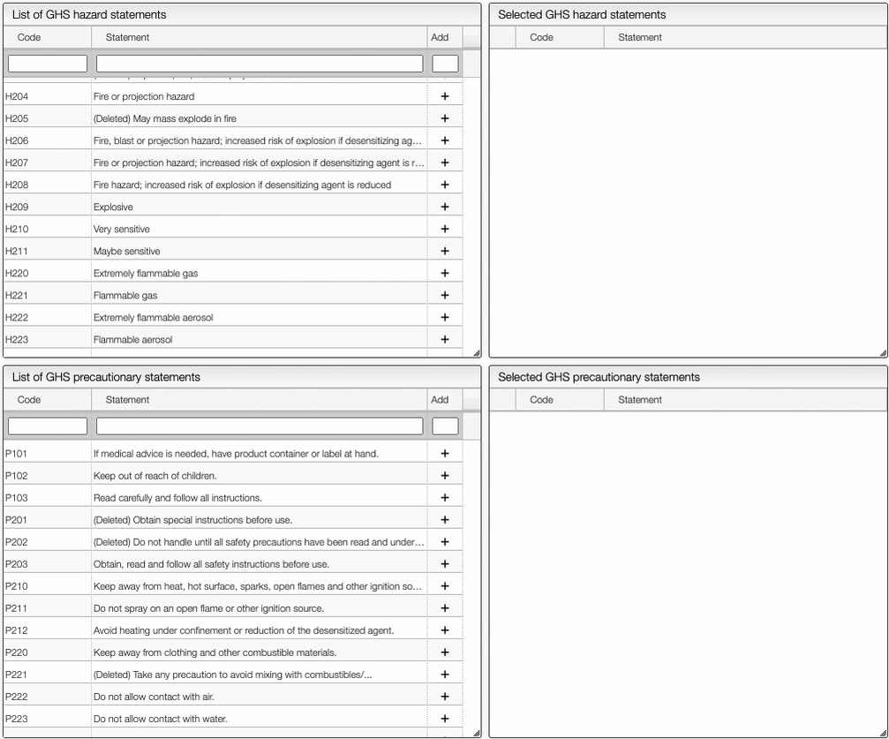

import JSMETip from '../../includes/ocl-tip.md'
import ExplodeSequences from './includes/explodeSequences/README.md'
import Metal from './includes/metal/README.md'
import Groups from './includes/mfGroups/README.md'
import MfInfo from './includes/mfInfo/README.md'
import MfIsotopes from './includes/mfIsotopes/README.md'
import MfParenthesis from './includes/mfParenthesis/README.md'
import ModifiedSequences from './includes/modifiedSequences/README.md'
import PrintReport from './includes/printReport/README.md'
import Rights from './includes/rights/README.md'
import StructureTemplate from './includes/structureTemplate/README.md'

# Create and edit a sample

You will see several modules covering the canvas and a few buttons. The buttons are there to **Save** your sample, to display this Help, and to generate a Report. The modules allow you to edit your sample’s data, to upload your spectra, and to display your spectra and other non-editable sample attributes.

:::info 

- **Sample code**: The sample’s unique identifier, defined at creation \(i.e. CAS number\). Non-editable.

- **Creation date**: The sample’s creation date. Non-editable.

- **Modif. date**: The date of the last modification to the sample’s data. Non-editable.

- **Description**: A brief description of the sample. Editable.

- **Structure editor**: Edit the structure associated with the sample. If you are using ChemDraw you may ‘copy as -&gt; molfile’, go over the structure editor and press `CTRL` + V.

- **Physical**: Read and edit the physical constants associated with the sample: boiling point \(bp\), melting point \(mp\), density and refractive index \(nd\).

- **MF and mw**: Molecular formula and molecular weight associated with the sample. Editable.

- **Attachments**: A list of all files attached \(e.g. JCAMP-DX files\).
:::

## Safety

The `Safety` button allows you to define the safety information associated with the sample. It is possible to add manually the GHS Pictograms, as shown below.

On the right of the window, you can see the list of **GHS Hazard Statements** as well as the **GHS Precautionary Statements**. You can add or delete them by clicking on the corresponding buttons. You can also search by the code (e.g. H302) or by the description. The process of adding GHS statements is shown below.

Once you have added all the necessary GHS pictograms, hazard and precautionary statements, you can save the information by clicking on the green `Save data` button.

:::note Upload spectra
To upload spectra via drag and drop, use the application specific view. Those views are design to automatically handle the conversion into a standard format.
That is, if you want to upload a PXRD attachment to your sample you need to open the PXRD view.

:::

<OCLTip/>

<ExplodeSequences/>

<Metal/>

<Groups/>

:::tip Editing the molecular formula (salts, isotopes)

<MfInfo/>
<MfIsotopes/>
<MfParenthesis/>

:::

<ModifiedSequences/>

<PrintReport/>

<Rights/>

<StructureTemplate/>
