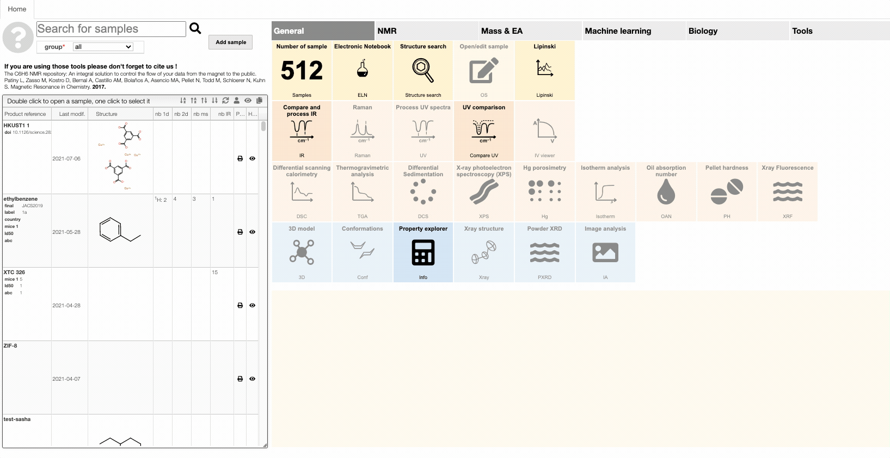

import JSMETip from '../../includes/ocl-tip.md'

# Create and edit a sample

You will see several modules covering the canvas and a few buttons. The buttons are there to Save your sample, to display this Help, and to generate a Report. The modules allow you to edit your sample’s data, to upload your spectra, and to display your spectra and other non-editable sample attributes.

- Sample code: The sample’s unique identifier, defined at creation \(i.e. CAS number\). Non-editable.

- Creation date: The sample’s creation date. Non-editable.

- Modif. date: The date of the last modification to the sample’s data. Non-editable.

- Description: A brief description of the sample. Editable.

- Structure editor: Edit the structure associated with the sample. If you are using ChemDraw you may ‘copy as -&gt; molfile’, go over the structure editor and press `CTRL` + V.

- Physical: Read and edit the physical constants associated with the sample: boiling point \(bp\), melting point \(mp\), density and refractive index \(nd\).

- MF and mw: Molecular formula and molecular weight associated with the sample. Editable.

- Attachments: A list of all files attached \(e.g. jcamp files\).

:::note Upload spectra
To upload spectra via drag and drop, use the application specific view. Those views are design to automatically handle the conversion into a standard format.
That is, if you want to upload a PXRD attachment to your sample you need to open the PXRD view.

:::

<OCLTip/>

:::tip Explode peptide or nucleic acid sequences
The editor can explode peptide or nucleic acid sequences. More information can be [found here](includes/explodeSequences/README.md).
:::

:::tip Coordinate covalent bond
It can be useful to denote to have special bond types between metal and ligands in metal complexes. Our editor can deal with that. More information can be [found here](includes/metal/README.md).
:::

:::tip Groups
Often it is more convenient to denote protective groups with Boc or amino acids with their three-letter code. Our editor understands this. More information can be [found here](includes/mfGroups/README.md).
:::

:::tip Editing the molecular formula (salts, isotopes)
You can also directly edit the molecular formula, for example to indicate salts.
More information can be [found here](includes/mfInfo/README.md).
This can also be useful to indicate isotopes, which is described [here](includes/mfIsotopes/README.md).
As described [here](includes/mfParenthesis/README.md) you can also use parenthesis in your molecular formula.
:::

:::tip Dealing with modified peptide or nucleotide sequence
You might need to deal with modifications at the terminal positions of your peptides. Our [editor gives you the tools to do so](includes/modifiedSequences/README.md).
:::

:::tip Printing reports and barcodes
It can be handy to print out an overview table of all information about a sample, including a barcode.
Our [system allows you to do so](includes/printReport/README.md).
:::

:::tip Modifying access rights
You might need to give some colleague access to your sample, for example, to upload a characterization.
Our [system allows you to do so](includes/rights/README.md).
:::

:::tip Structure history
Our editor remembers the last 20 structures and allows you to start a new molecule drawing from a previous one.
Find more info [here](includes/structureTemplate/README.md).
:::
