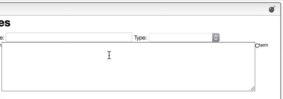

:::tip Explode nucleic and peptidic sequences

    

    The editor can explode peptide or nucleic acid sequences.
    

    

## Explode nucleic and peptidic sequences

Most of the time you enter a peptide or nucleic acid sequence as a one-letter code.

However, it may happen that you have the terminal chain modified, as in the case of a small tripeptide `AAL` that would have a Boc on the N-terminus and a NH2 on the C-terminus.

To enter it correctly, you should first enter the sequence `AAL` and then explode the sequence. You may then change the N-term and C-term.

:::