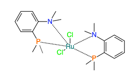

:::tip Coordinate covalent bond

    

    It can be useful to denote to have special bond types between metal and ligands in metal complexes. Our editor can deal with that.
    

    

## Drawing metal complexes

The chemical structure editor (openchemlib) allows drawing coordinative covalent bonds. In order to draw a 'zero order' bond you need to first draw a single bond between an atom and a metal. With the single bond drawing tool selected you can then click on the bond couple of times in order to get the dotted bond.

The molecular formula will be calculated automatically, and we consider, for this example, 3 different molecules.

:::
