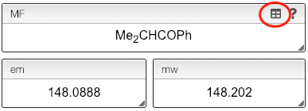
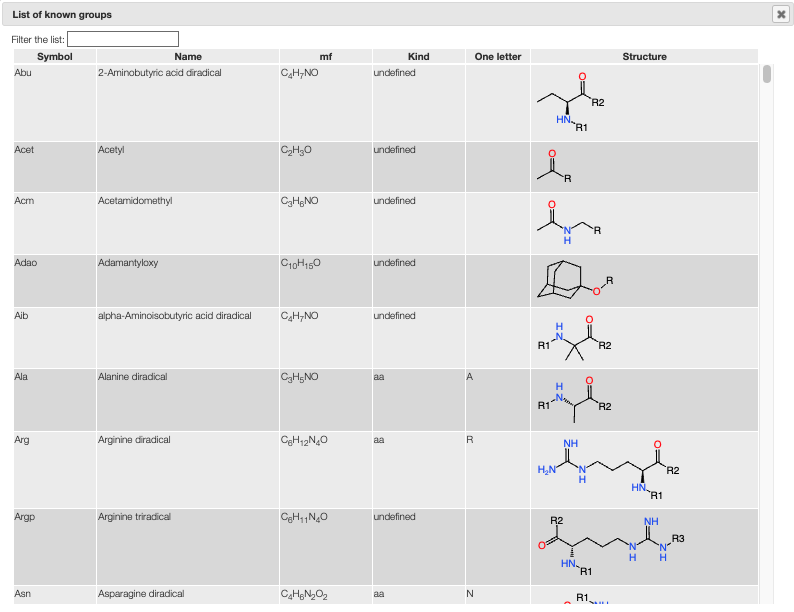

:::tip Groups

    

    Often it is more convenient to denote protective groups with Boc or amino acids with their three-letter code. Our editor understands this.
    

    

## Molecular formula: using groups

While the molecular formula is calculated automatically from the chemical structure it is sometimes useful to directly edit the molecular formula.

In the editor you are allowed to use groups like `Ala`, `Me`, ...

The full list of allowed groups can be seen by clicking on the little grid icon.

:::