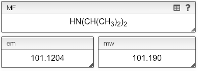

    

    You can also use parenthesis in your molecular formula.
    

    

## Molecular formula: parenthesis

While the molecular formula is calculated automatically from the chemical structure it is sometimes useful to directly edit the molecular formula.

The mass editor allows using as many parenthesis levels as you want.

