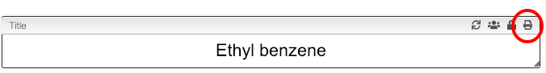

:::tip Printing reports and barcodes

    

    It can be handy to print out an overview table of all information about a sample, including a barcode.
    

    

## Print report and get barcode

It is possible to print the report from any tab. You should simply click on the `Print` icon that is present in the description.

This will produce a report that contains barcode that represent this specific sample.

:::