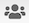
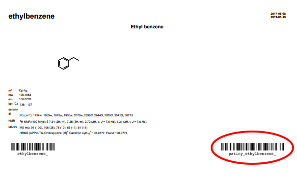

# Title tab 

The title tab appears in all the views proposed by the `Open/edit sample` module. When you write something in this tab, it would be automatically updated in the report, but also in the `Title` tab of the other views. 

Four icons are displayed on the top right of the tab:
-  allows you to reload the data from the server. The modifications you did are locally stored until you click on `Save data`. At this point, the modifications are stored in the server. If you did not save your changes before reloading, you would lose them and come back to the latest version saved. When you click on the icon, a tab will appear to confirm your action and avoid any unwanted loss.
-  allows you to manage the access to the sample information. You can either select or unselect an existing group or add a new owner using an email address or a group name. The new owner would be able to edit the information about the sample. 
-  gives you access to the security record information about the sample, such as the creation and last modification dates and the name of the owners. 
-  allows you to print the report in a format corresponding to the template selected in the `Overview` view. The report will contain a barcode that represents this specific sample.

