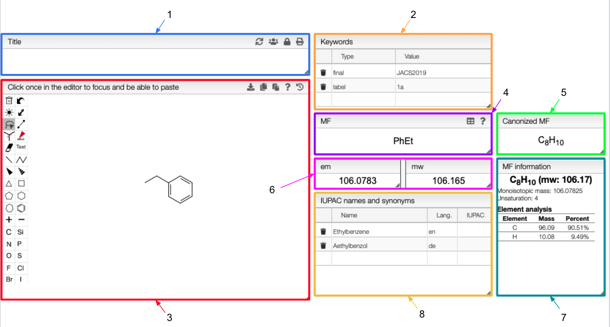
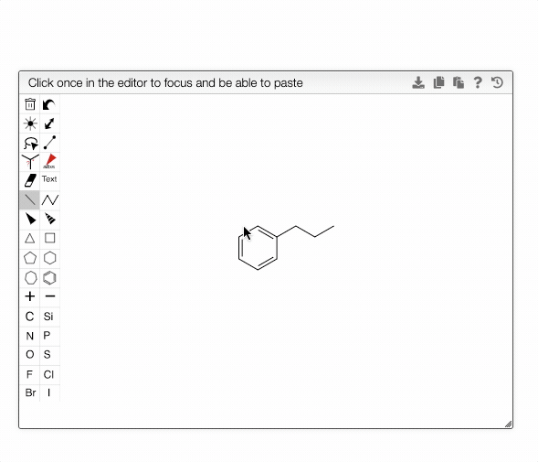
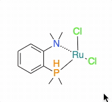

# Molecule

:::info Overview

1. If you write a title in this tab, it will be automatically updated in the `Title` tab of the over views and will appear in the final report. [Click here](../includes/titletab/README.md) for more information.
2. The keywords appear in the main table of the homepage. You would be able to search for your sample in the homepage according to those keywords.
3. You can change the structure of your sample here. The new molecular formula and molecular weight would be automatically calculated and the structure would be updated in all the view of this tile. 
4. If you change the molecular formula, the new one would appear in the report.
5. The canonized molecular formula depends directly on the molecular formula. It is updated every time the molecular formula changes. 
6. Electromagnetic mass and molecular weight, calculated from the molecular formula.
7. Information about the molecular formula: monoisotopic mass, unsaturation and element analysis.
8. IUPAC names and synonyms. Different languages can be used and are specified according to the [ISO country codes](https://en.wikipedia.org/wiki/List_of_ISO_3166_country_codes). 

:::

## Molecule editor

The structure edition is powered by OpenChemLib. To get all the information on the edition of the structure, click on the  icon on the top right of the tab. 

You are able to download the structure as a SVG file or copy the Molfile attached to the structure using the  and  icons respectively.

:::tip

You can modify the structure as much as you want and go back to the previous one using the  icon. All the previous saved structures are conserved and you can come back to a particular one at any time.

:::

The chemical structure editor allows drawing coordinative covalent bonds. In order to draw a `zero order` bond, you need to first draw a single bond between an atom an a metal. With the single bond drawing tool selected, you can then click on the bond couple of times in order to get the dotted bond. 

## Molecular formula

You can modify the molecular formula of your sample in the `MF` tab. The `em`, `mw`, `canonized MF` and `MF information` tabs will automatically updated. 

The molecular formula also supports abbreviations such as Ph or Et. A detailed list of groups and symbols is given if you click on the  icon on the top right of the `MF` tab.

:::tip How to enter a molecular formula ?

In a molecular formula, it is possible to define multiple components, isotopes, non natural isotopic abundance as well as to use groups and parenthesis. 
- isotopes will be placed in brackets, e.g. [13C], C[2H]Cl3
- non natural abundance will be specified in curly brackets, e.g. C{50,50}10 means that you have 10 carbons and a ratio 50:50 between 12C and 13C.
- group abbreviation: you may use in molecular formula groups like Ala, Et, Ph, etc...
- multiple components should be separated by '.', e.g. Et3N . HCl 
- hydrates on non-integer molecular formula may be specified with numbers in front of the MF, e.g. CaSO4 . 1.5 H2O. 
- parenthesis: any number of parenthesis may be used, e.g. ((CH3)3C)3C6H3 

:::

## Molecular formula information 

The `MF information` tab is related to the `MF` tab. It indicates the molecular weight, the monoisotopic mass, the unsaturation and the elemental analysis of the molecule corresponding to the molecular formula in the `MF` tab. 