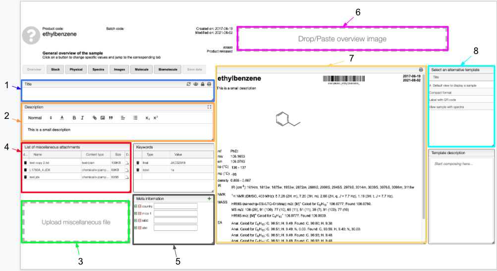

# Overview

This view contains the general information about your sample. 

:::info 

1. Add a title that would appear in the final report (in the default view). This tab appears in all the views proposed by the `Open/edit sample` tile. [Click here](../includes/titletab/README.md) for more information. 
2. Add a description that would appear in the final report (in the default view). 
3. Upload miscellaneous files linked to your sample. 
4. List of the miscellaneous files uploaded. You are able to download those files by clicking on the  button. 
5. Meta information related to your sample.
6. Drop/paste an image of your sample (e.g. leaf, plant).
7. Overview of the report. 
8. Change the format of your report. Predefined templates are proposed but you can also create a report with your own preferences. 

:::

You are able to add meta information related to your sample. To add or remove one of them, use the  buttons and enter the parameter name. These meta information will appear in the table of content in the Home Page. From the Home Page, you would be able to search for your sample according to its meta information. (`Keywords` tab has the same functionality but use preferably `Meta information` tab).

:::caution

Do not forget to Save your data on the server ! If you reload from the server using  without saving your data, you will lose your changes. 

:::

When you want to print your report, you can select different format proposed in the `select an alternative template` tab. The view of the report is automatically updated.  