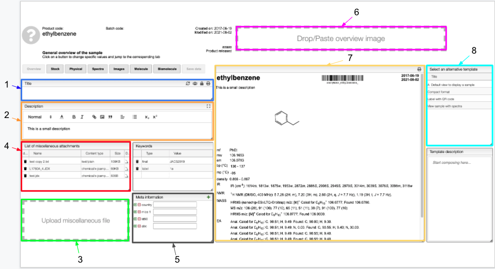
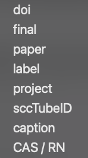

# Overview

import TitleTab from '../includes/titletab/README.md'

This view contains the general information about your sample.

:::info

1. Add a title that will appear in the final report (in the default view). This tab appears in all views proposed by the `Open/edit sample` tile.
2. Add a description that will appear in the final report (in the default view).
3. Upload miscellaneous files linked to your sample.
4. List of the miscellaneous files uploaded. You can download those files by clicking on the  button.
5. Meta information related to your sample.
6. Drop/paste an image of your sample (e.g., leaf, plant).
7. Overview of the report.
8. Change the format of your report. Predefined templates are available, but you can also create a report with your own preferences.

:::

<TitleTab/>

You can add meta information related to your sample. To add or remove an entry, use the  buttons and enter the parameter name. This meta information will appear in the table of contents on the Home Page. From the Home Page, you can search for your sample by its meta information. (The `Keywords` tab has the same functionality, but the `Meta information` tab is preferred.)

Keywords include the following fields:

The `CAS/RN` field is highlighted in red if the CAS number is not valid. Otherwise, it will be highlighted in green. In case the CAS is valid, you can click on the lookup button  in the `rn` column to retrieve the commercial information from a reference database.

:::caution

Do not forget to save your data on the server. If you reload from the server using  without saving your data, you will lose your changes.

:::

When you want to print your report, you can select a different format from the `select an alternative template` tab. The report view is automatically updated. The produced report will contain a barcode representing the specific sample.