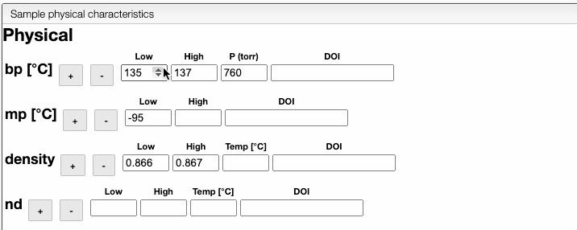

# Physical characteristics

In this view, you can enter physical properties of your sample, such as boiling point, melting point or density. If you wish, you can add several entries for each property, using the  buttons. You can also rapidly adjust the values as shown below. 

