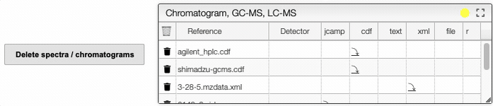

# Spectra

This view allows you to visualize spectra related to your sample. There are over 20 different file formats supported for spectra, but only the JCAMP-DX file can be visualized in this view. In order to upload new spectra and convert it in a FAIR format, you should go to the specific tile from the homepage. You can either go back to the homepage and select the tile (e.g. `IR spectra` to upload an infrared spectrum, `isotherm analysis` to upload an isotherm) or click on the colored sticker on the top right of the table. You would be automatically redirected to the tile of interest.

:::info

All the files can be downloaded using the  icon. All the formats can be downloaded, but only JCAMP-DX files can be visualized.

:::

In the `Jcamp previsualization` tab, you can download as an SVG file the spectrum you are currently looking at by clicking on the  icon.

It is possible to select multiple spectra within a category (IR, UV, NMR...) by clicking holding the `ctrl` (`cmd`) key and clicking on all the spectra you want to select. Alternatively, if you want to select successive spectra, you can click on the first one, hold the `shift` key and click on the last one. Then, spectra can be deleted by clicking on the delete button. The full screen button allows you to see the list of available spectra in a larger window.

