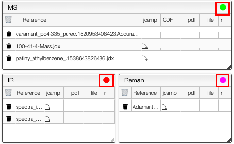

# Spectra

This view allows you to visualize spectra related to your sample. There are over 20 different file formats supported for spectra, but only the JCAMP-DX file can be visualized in this view. In order to upload new spectra and convert it in a FAIR format, you should go to the specific tile from the homepage. You can either go back to the homepage and select the tile (e.g. `IR spectra` to upload an infrared spectrum, `isotherm analysis` to upload an isotherm) or click on the colored sticker on the top right of the table. You would be automatically redirected to the tile of interest. 

:::info

All the files can be downloaded using the  icon. All the formats can be downloaded, but only JCAMP-DX files can be visualized. 

:::

In the `Jcamp previsualization` tab, you can download as a SVG file the spectrum you are currently looking at by clicking on the  icon. 