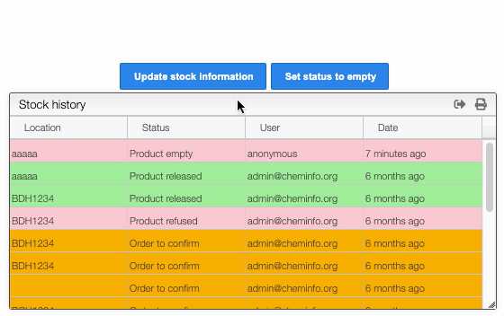

# Stock information about the sample 

In this view, you can add stock information about your sample. This chemical library allows you to edit the location and the status of your sample using the `Update stock information` button. You can also directly set the status to empty. 

The `Stock history` tab contains all the previous location and status of the sample, as well as the date of the modification and the information about the user. The rows are colored according to the status of the sample (e.g. red for empty or refused product, green for released product, white if no status is specified).

