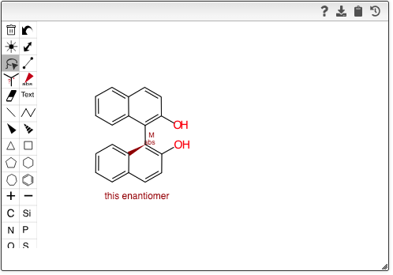

## BINAP and axial chirality

The chemical structure editor (openchemlib) allows to specify the axial chirality of molecules for which rotation around a single bond is blocked.

To specify the chirality you need to add a chiral bond on a **single-bond** that is next to the chiral bond.

