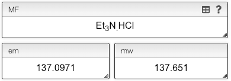

## Molecular formula: salt and multiple components

While the molecular formula is calculated automatically from the chemical structure it is sometimes useful to directly edit the molecular formula.

You may enter a multipart molecular formula by separating all the parts by a `.`.

The monoisotopic mass as well as the molecular weight will be calculated correctly.

