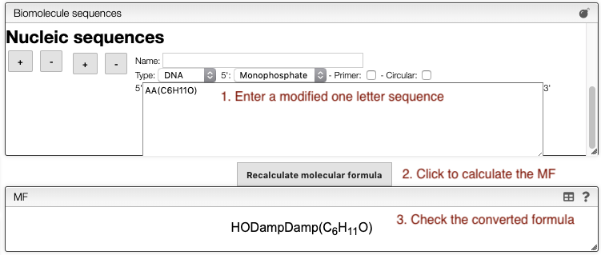

## Deal with modified peptide or nucleotide sequences

Peptides, proteins and nucleotides may contain non-natural amino acids or nucleic bases. They may also have chain modifications at the terminal positions. This could be the result of post-translational modifications (PTM), synthesis using non-natural amino acids, etc.

In order to deal with those cases the system allows entering sequences using one-letter code and all the modifications in parentheses either at a terminal position or directly after the residue.

Everything that is in parentheses will stay untouched and if a terminal position contains a parenthesis it will not be modified.

Examples:

- Peptidic sequence
  - AAA(NH2) = HAlaAlaAlaNH2
  - (Me)C(S-1Se)(NH2) = Selenocysteine with N-terminal methylated and C-terminal amide
- Nucleic sequence
  - AA(C6H11O) = AA(C6H11O) : A dinucleotide on a glucose
