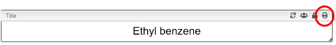
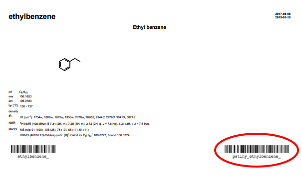

## Print report and get barcode

It is possible to print the report from any tab. You should simply click on the `Print` icon that is present in the description.

This will produce a report that contains barcode that represent this specific sample.

