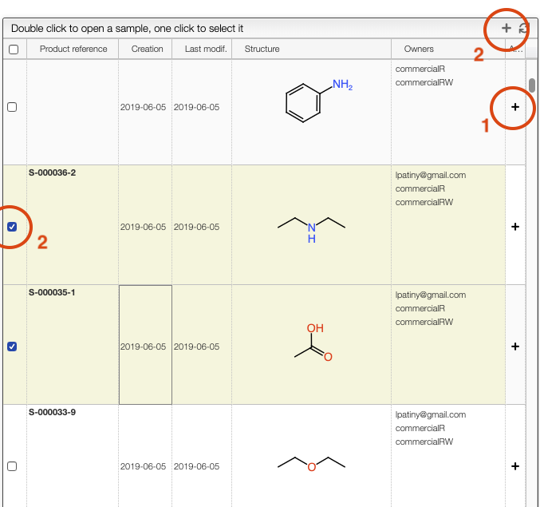

# Sample rights

This view allows to manage the rights of samples:

- add a specific user (email address)
- add a specific group
- remove a specific user (email address)
- remove a specific group

In order to proceed you should first select a list of samples to which the modification applies.

There are 2 ways to select sample. The first is by clicking on the 'plus' symbol present on the right of the sample line. The second is by selecting some samples from the list and then clicking on the 'plus' symbol present on the top of the window.

Once sample have been selected you can either `Add` or `Delete` a right by clicking on the corresponding button and entering an owner.

An owner is either:

- a specific user (the email address of the user) and adding a specific user will provide READ and WRITE access to the sample
- a specific group as defined by the administrators and managed by 'ROC'. You should contact your administrator to either create a new group or add / remove users from the group. A group may have read/write access or read only access.
