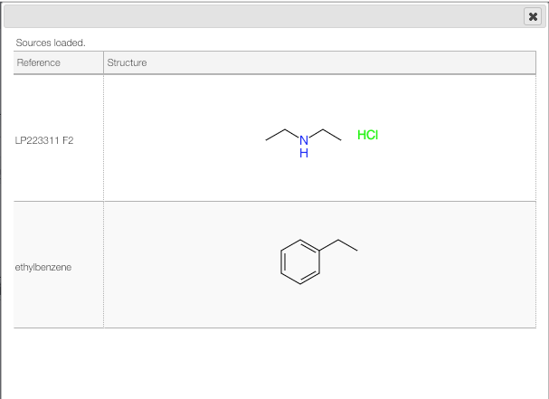

## Reload previous structures in the molecule editor

The structure editor remembers the last 20 edited structures. If you want to start your new molecule from a previous one you may simply click on the history icon.

A list showing the last edited structures will appear, and you should just click on one of them to use it as a template.

