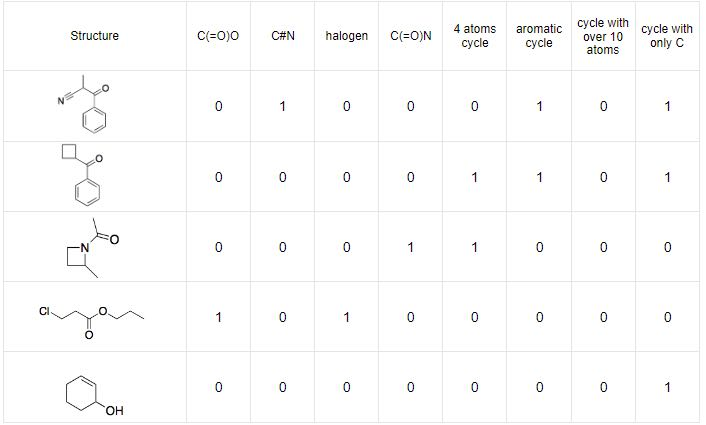
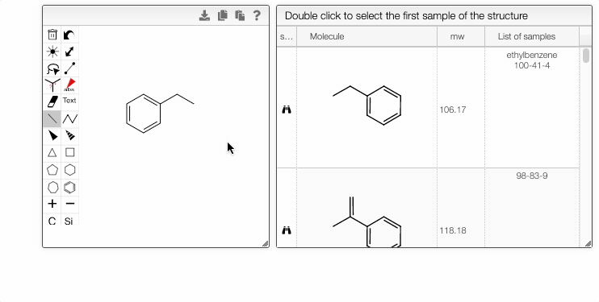
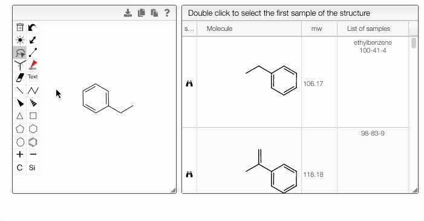

# Structure search

You can perform a structure search if you are looking for molecules with a specific pattern or a fragment. This tool is useful when navigating many samples.

When you select a sample from the `Home` page and click the `Structure search` module, the chosen molecule will be searched by default. Alternatively, you may modify the structure in the OCL editor. The matching structures will be available in the tab on the right.

:::note

If a molecule appears in more than one sample, you can choose the entry in the `List of samples` tab.

- The right module displays the list of samples associated with the selected structure. Double-clicking a row will take you back to the main tab, with the corresponding sample selected in the List of selected samples.
- Double-clicking a row in the center module will take you directly to the first matching sample.

:::

There are two available search modes: by [substructure and by similarity](10.1186/s13321-015-0061-y). Both are based on 512 molecule fragments. Each fragment is described by binary numbers, representing the presence or absence of certain attributes.

In the case of substructure search, the matching molecules contain at least those fragments that were in the query substructure. The structure search uses the same algorithms implemented in [Datawarrior](http://www.openmolecules.org/datawarrior). They are open source and available as part of openchemlib \([https://github.com/actelion/openchemlib](https://github.com/actelion/openchemlib), [https://github.com/cheminfo/openchemlib-js](https://github.com/cheminfo/openchemlib-js)).

The similariy search is based on [Tanimoto algorithm](https://en.wikipedia.org/wiki/Jaccard_index). It uses the cumulated fragment value and compares the distance between two molecules in the descriptor space. The Tanimoto coefficient can take values between 0, for completely dissimilar molecules, and 1, for identical molecules. Beyond the threshold of 0.85, the molecules are considered similar.

Structure edition is powered by [OCL editor].

## Advanced features

You can fine-tune the search by specifying atomic and bond properties. These options can be accessed by hovering over the atom or bond of interest and pressing `q`. For example, you can allow certain atoms at this specific position, or you can modify the ring size.

Furthermore, you can include separate molecules in the search. This will result in structures containing both fragments with no restrictions on orientation or connectivity. One of the molecules can be selected and excluded from the search. It removes the structures completely from the search results. The excluded fragment is highlighted in pink.

