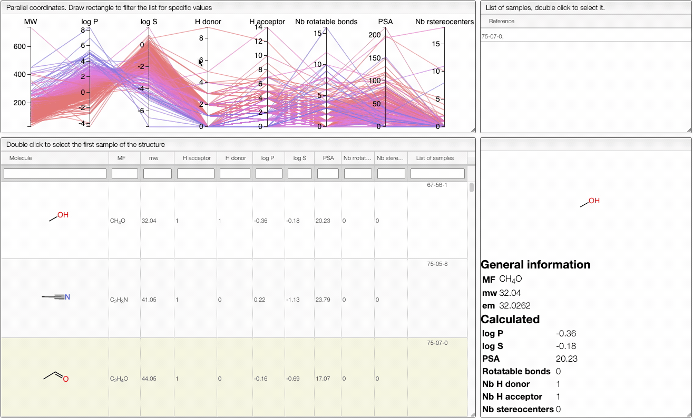
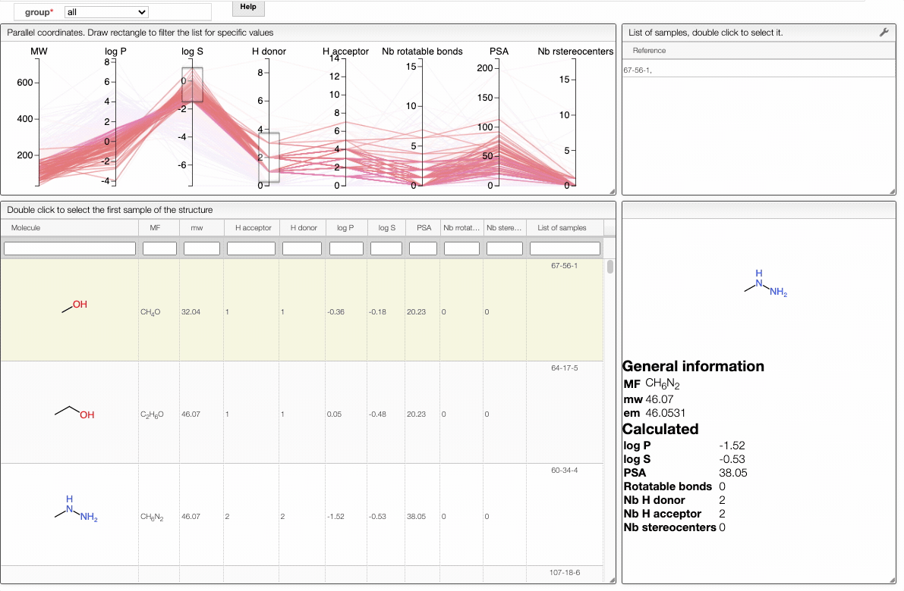
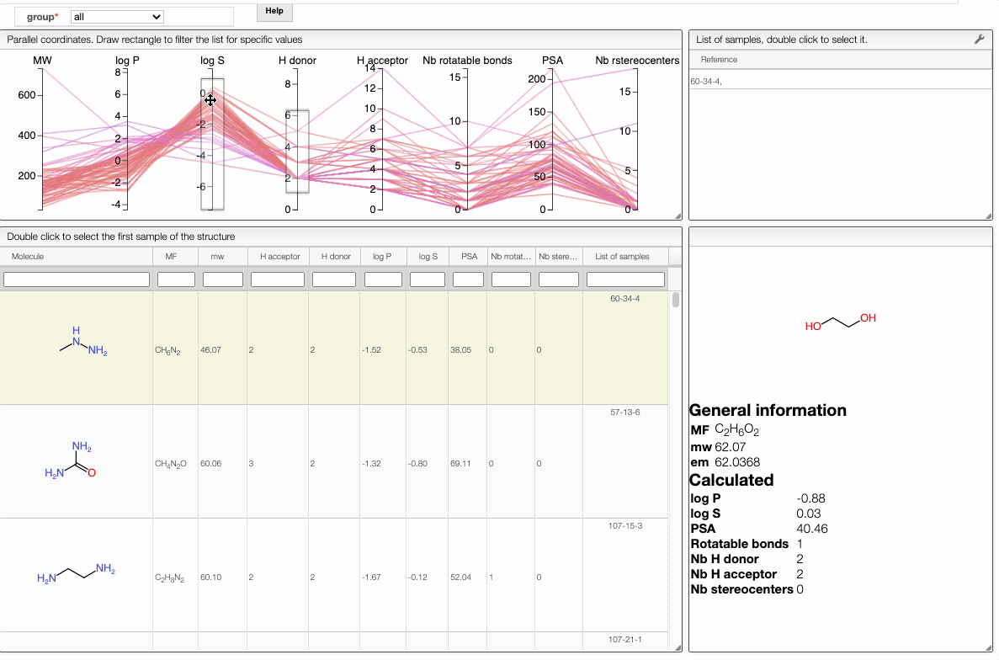
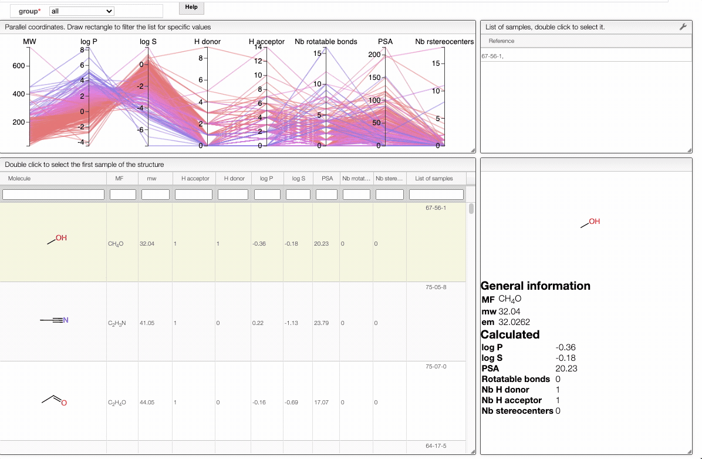

# Lipinski search

This view allows you to filter your samples according to [Lipinski's rule of five](https://en.wikipedia.org/wiki/Lipinski%27s_rule_of_five) using an interactive parallel coordinates plot. 

:::info

Lipinski's rule of five evaluates druglikeness of molecules. It states that, in general, an overall active drug has no more than one violation of the following criteria:
- molecular mass less than 500 Da
- no more than 5 hydrogen bond donors (number of nitrogen-hydrogen or oxygen-hydrogen bonds)
- no more than 10 hydrogen bond acceptors (number of nitrogen or oxygen atoms)
- an [octanol-water partition coefficient](https://en.wikipedia.org/wiki/Octanol-water_partition_coefficient) (log P) that does not exceed 5 (measures the relationship between lipophilicity and hydrophilicity of substance: the value is smaller than 1 for a substance that is more soluble in water and greater than one if it is more soluble in a fat-like solvent such as octanol)

Even if this rule gives an indication on the druglikeness of a molecule, it does not predict its activity. It has been highly influential in drug discovery but only 50 % of orally new chemical entities actually obey it. 

:::

The interactive parallel coordinates plot contains the criteria of Lipinski's rule of five, as well as:
- the number of rotatable bonds 
- the number of stereocenters
- the polar surface area (PSA) 
- the water solubility of the molecule, given by log S 

In order to filter your samples, simply select a range around the parameter of interest, e.g. logP, and the table will automatically update. You can simultaneously use filters on different parameters and define multiple ranges for the same criterion. 

You can also move the selection vertically or adjust the size of the range.

By clicking on a vertical bar outside the selected range you can reset the selection.

Also, the table has a hoover functionality, which will highlight the line of a compound in the parallel coordinates plot.

:::info 

The color of the lines is given by the value of log P: blue for large positive log P (lipophilic compound), red for large negative log P (hydrophilic compound).

:::

 To get access to information about a molecule, you can either double click on the structure in the main table to select the first sample or select a specific sample in the `List of samples` tab when several samples are available. 