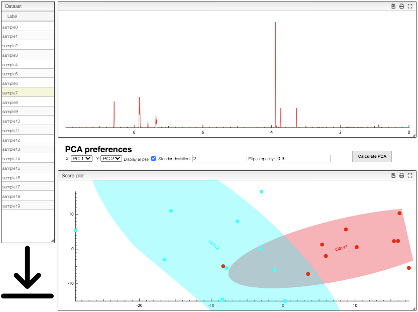

## Check and download

The`Generate dataset` button will trigger the computation of the dataset and allows you to check the results by directing you to the `Results` layer. In this page you will be able to review the resulting spectra, look at a simple PCA, and download the dataset as csv or tsv.

