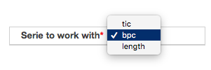
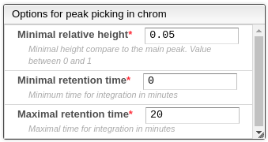

# Chromatogram visualization

When the desired file is clicked, the corresponding chromatogram is displayed, according to the following options:

- Serie to work with: visualize and select peaks based on the total ion chromatogram \(tic\) or the base peak chromatogram \(bpc\).

## Peak picking in the chromatogram

### Automatic peak picking

Automatic peak picking is done using some parameters that allow to filter and improve the results. This peak picking is based on the analysis of the first and second derivative of the chromatogram, therefore the beginning of the peak is where there’s an inflection point. The parameters are the following:

- Minimal relative height: the minimal ratio between the height of the current peak and the highest peak.
- Minimum retention time: the retention time at which integration begins.
- Maximal retention time: the retention time at which integration ends.

### Manual peak picking

All automatic peak-picking can be modified: First select the peak to be modified in the list of peaks \(right\) and then ALT + Click at the desired beginning of the peak followed by the desired end of the peak in the chromatogram. New peaks can be created using the button below the peaks table or clicking on the plus icon over the table.

Note: automatic peak picking will replace any current peak selection, therefore it's recommended to first use automatic peak picking followed by manual selection.
