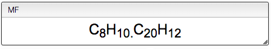

# GC / LC - MS visualization

This application enables the visualization and integration of GC / LC data with or without MS.

## Loading files

Files can be uploaded either as a JCAMP, NetCDF or mzData format. Multiple files can be drag and dropped into the highlighted zone or selected by ctrl-clicking in the pop-up window. The files are listed below the drop zone and are visualized when clicked.

## Molecular Formula (MF)

Moelcular formula are specified here. Several formula can be defined  by separating with a dot.

For single formula, the monoisotopic mass and molcular weight are displayed below.

## Mass modifications (ion adducts) and isotopic distribution

In order to calculate the theoretical masses you need to define the ion adduct. Many adducts can be defined at once by separating with commas. You may also define multiple charges.

All the possible masses (based on input formula and ion adducts) are displayed as a virtual green spectrum, and listed in the bottom-right.

## Mass Spectra Related Preferences

This section contains global settings for the manipulation of mass spectra and extracted ion chromatograms \(EIC\).

The **mass tolerance** is the tolerance used when integrating mass spectra into a chromatogram peak (should be less than the sampling distance).

The **mass extraction window** determines the minimum and maximum extracted masses for EIC based on the input m/z.

The **height threshold** defines the minimum relative height for a peak to be included in EIC.

The **list of specific EIC to superimpose** can be used to manually input specific masses and formula for creation of EIC.
