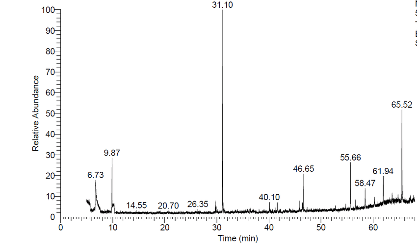

# GC/LC-MS chromatography 

Chromatography, such as [gas chromatography (GC)](https://en.wikipedia.org/wiki/Gas_chromatography) or [liquid chromatography (LC)](https://en.wikipedia.org/wiki/Liquid_chromatography%E2%80%93mass_spectrometry), is a laboratory technique allowing to separate mixtures. A sample is dissolved in a fluid (gas or liquid) which travels through a solid system (column, plate, sheet, capillary tube). The fluid is often called the mobile phase and the system is termed the stationary phase. Since different constituents of the mixture have different affinities for the stationary and the mobile phases, they will move with different apparent velocities. This difference in the apparent velocities allows to separate the components.
First, the mixture is separated and then the components are detected using mass spectrometry.

