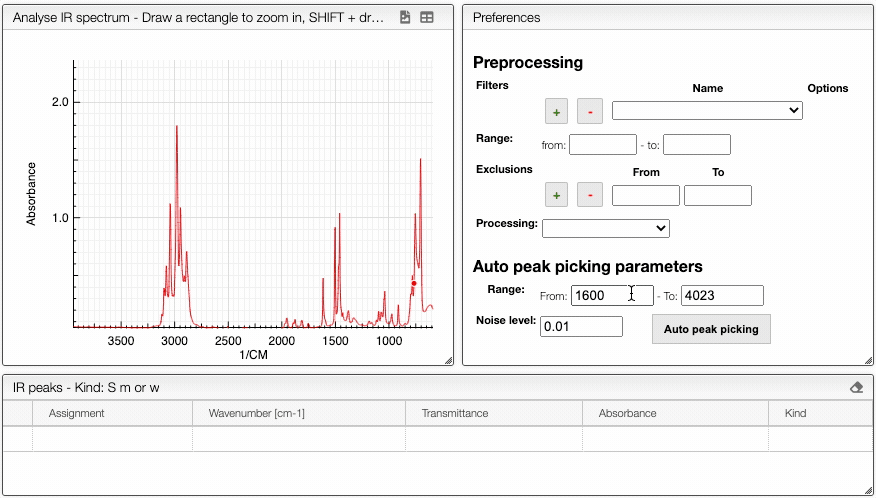

## Auto peak picking

The system can automatically pick peaks of interest for a specific range of wavenumbers with a defined noise level using `Auto peak picking` tab.

Auto peak picking is based on the Savitzky Golay filter.

