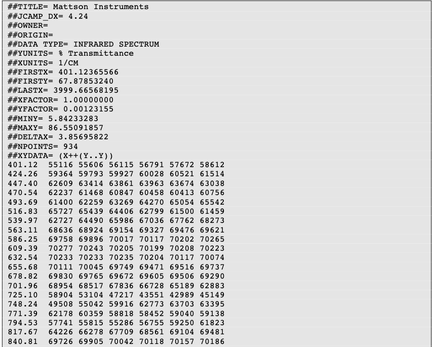
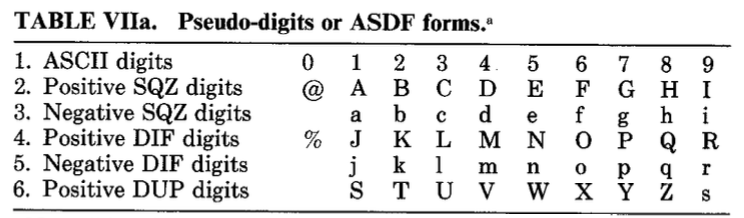
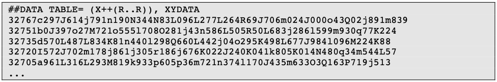

## JCAMP file format

JCAMP-DX (Joint Committee on Atomic and Molecular Physical Data Exchange) is a standard file format for the exchange of spectra and related physical and chemical information between different spectrometers, databases or other systems.

The information is stored using ASCII characters and the file can be viewed, corrected and annotated with a text editor. The spectra are stored as a table containing (x,y) coordinate pairs. Besides the data points, it is possible to store metainformation and make comments. The file extension in  .jdx.

A JCAMP document is composed of an unlimited number of Labelled Data Records (LDRs). Each LDR starts with a “**##**” and ends with “**=**”. Any space, comma, slash or hyphen is removed and the text is written with capital letters.

Some examples of Data Labels:
- TITLE : title of the experiment
- END : the last line of the file
- XUNITS : the units reported on the x-axis
- NPOINTS : number of points

Two important LDRs are “XYDATA” and “PEAKTABLE”, which contain the spectral information. The former gives information in the form of a table where the first value in a line stands for an x coordinate and any subsequent values are y-coordinates with an equidistant increment on the x-axis. The latter provides information as a collection of (X,Y) pairs. 

It is commonplace to compress the data tables. For instance, the table of numbers can be replaced by a line of characters (pseudo-digits). Among these pseudo-digits, there are PAC, SQZ, DIF, DIFDUP.

An example of compressed data using DIFDUP

An in depth description is given in the original paper by [McDonald and Wilks](http://old.iupac.org/jcamp/protocols/dxir01.pdf). Insofar as JCAMP is a well-described and accessible format, it partially aligns with the FAIR (**F**indable, **A**ccessible, **I**nteroperable, **R**eusable) principles . It is interoperable and reusable. Provided that the user makes it findable and accessible, JCAMP will fully comply with the aforementioned principles.