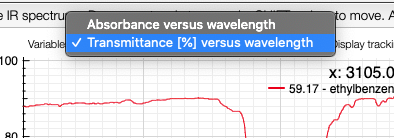

# Switch between absorbance and transmittance

When loading an IR spectrum, the application is aware if it was acquired in transmittance or absorbance mode. If you want to switch between the two modes, you may click on the toggle icon shown below. 

The application will remember your preferred mode for the next time.

