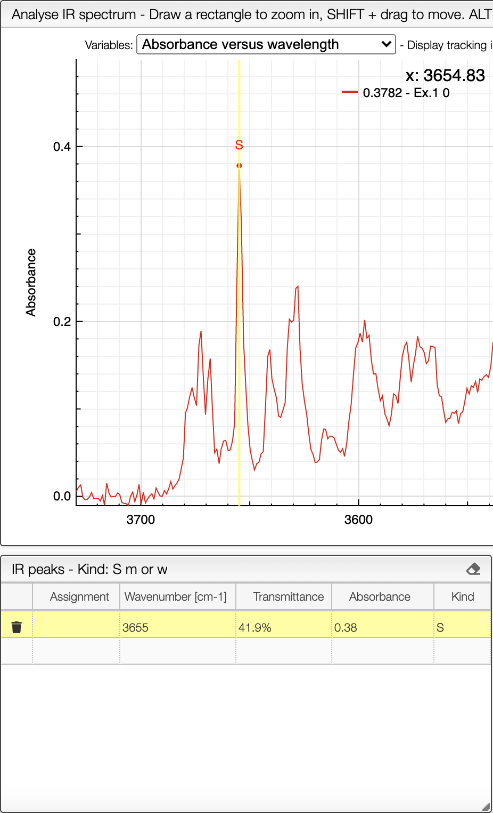

# Peak peaking

It is possible to manually pick peaks on an infrared spectrum by holding down the ALT key, and then right-clicking on the peaks of interest.

The application will systematically look for the strongest signal close to the wavelength that has been clicked. 

The peak will then be displayed under __IR peaks__

