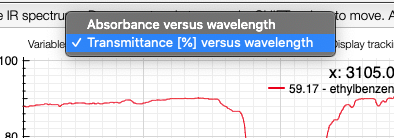
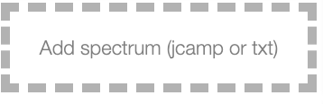

# View and process infrared spectra

<iframe width="560" height="315" src="https://www.youtube.com/embed/7iLuVpt5IXc" title="YouTube video player" frameborder="0" allow="accelerometer; autoplay; clipboard-write; encrypted-media; gyroscope; picture-in-picture" allowfullscreen></iframe>

In this view it is possible to upload an infrared spectrum by drag / drop either a jcamp or a text file.

Once the spectrum is uploaded you can visualize the spectrum by clicking on his name.

:::tip Switch between absorbance and transmittance

When loading a spectrum the application is aware it was acquired in
transmittance or absorbance mode.

If you want to switch between the 2 you may click on the toggle icon. The application
will remember your preferred mode for the next time.

:::

It is then possible to `ALT + click` in the peak in order to store representative peaks of this sample. The categorization `S`, `m`and `w` is done automatically based on the highest and lower selected peak.

:::caution
Don't forget to `Save data` before leaving the page!
:::

## Upload IR spectra

You can upload an IR spectrum in 3 different ways:

- by drag and drop
- by clicking on the upload zone and selecting the file
- by copying the spectrum in the clipboard and make a <kbd>CTRL</kdb>+<kbd>V</kbd>(or <kbd>⌘+V</kbd>on macOS).

The format of the file should be a jcamp (extension .dx or .jdx) that is a usual
exportation format on all the IR spectrophotometer.

## Peak picking

It is possible to make a manual peak picking on infrared spectra by pressing
the ALT key pressed and clicking on a peak.

The application will systematically look for the strongest signal close the wavelength that has been clicked.

## Auto peak picking

Auto peak picking is based on the Savitzky Golay filter.

It allows to find all the peak between 2 wavelengths (from / to) that has a ratio
signal-to-noise over a defined limit (Noise level).
