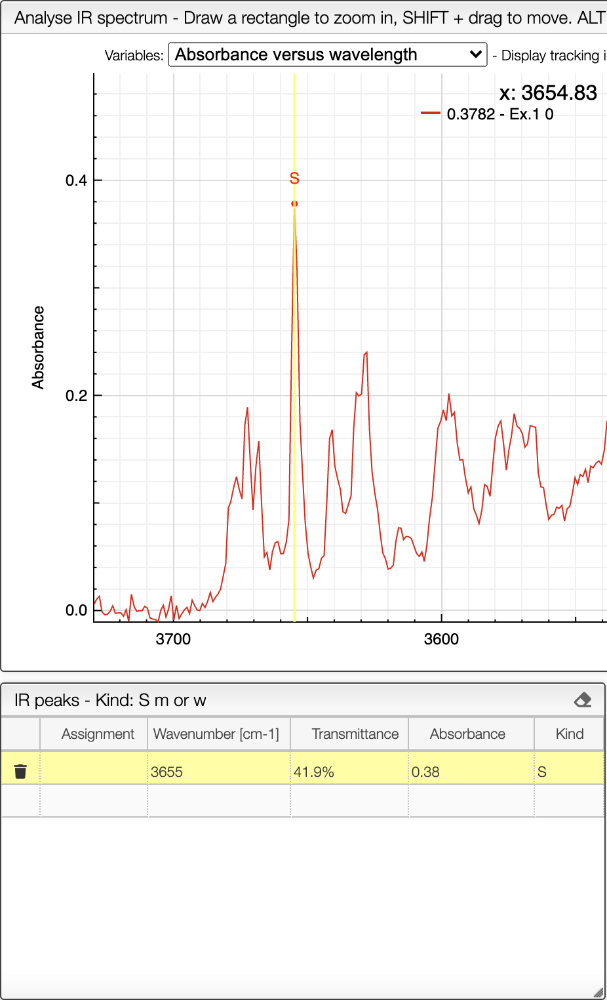
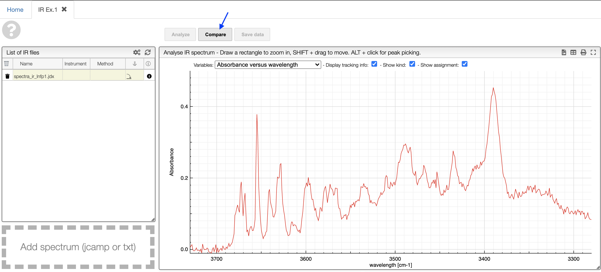
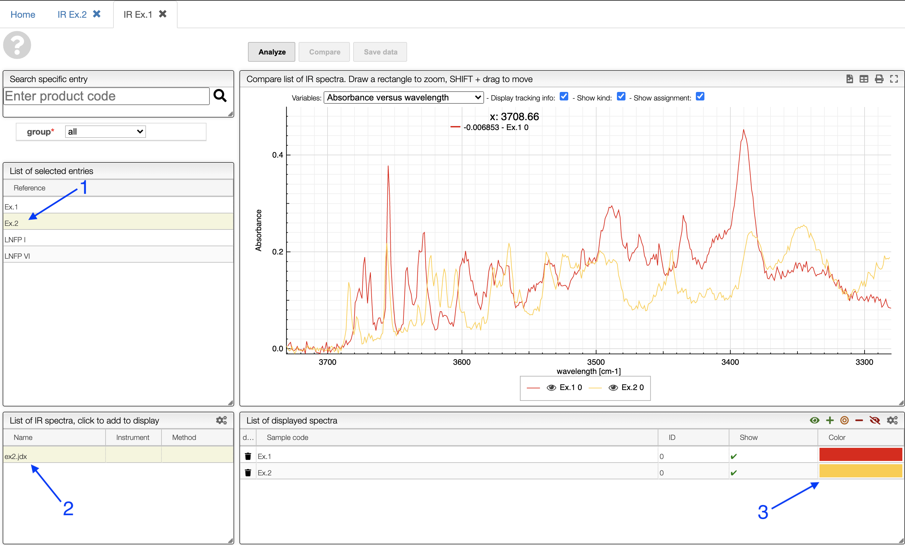

# View and process infrared spectra

<iframe width="560" height="315" src="https://www.youtube.com/embed/7iLuVpt5IXc" title="YouTube video player" frameborder="0" allow="accelerometer; autoplay; clipboard-write; encrypted-media; gyroscope; picture-in-picture" allowfullscreen></iframe>

In this view it is possible to upload an infrared spectrum by drag / drop either a jcamp or a text file.

Once the spectrum is uploaded you can visualize the spectrum by clicking on his name.

:::tip Switch between absorbance and transmittance

When loading an IR spectrum, the application is aware if it was acquired in transmittance or absorbance mode. If you want to switch between the two modes, you may click on the toggle icon shown below.

The application will remember your preferred mode for the next time.

:::

It is then possible to `ALT + click` in the peak in order to store representative peaks of this sample. The categorization `S`, `m`and `w` is done automatically based on the highest and lower selected peak.

:::caution
Don't forget to `Save data` before leaving the page!
:::

## Upload IR spectra

You can upload an IR spectrum in 3 different ways:

- by dragging your files and then dropping them in the designated zone.
- by clicking on the upload zone and selecting the files to upload.
- by copying the spectrum into the clipboard and then pasting it using CTRL+V (or ⌘+V on MacOS).

The format of the file to be uploaded should be jcamp (extension .dx or .jdx), this is the usual format used on most IR spectrophotometers.

## Peak picking

It is possible to manually pick peaks on an infrared spectrum by holding down the ALT key, and then right-clicking on the peaks of interest.

The application will systematically look for the strongest signal close to the wavelength that has been clicked.

The peak will then be displayed under **IR peaks**

## Auto peak picking

Auto peak picking is based on the Savitzky Golay filter.

This allows you to find all the peaks within a range of wavelengths (from / to), that have a signal-to-noise ratio that is greater than a defined limit (Noise level).

## Comparing

You can compare multiple IR spectra by first opening up an IR spectrum, and then clicking "Compare" on top of the IR spectrum.

After which, under **List of selected entries** (1), you can choose the other molecule which has the spectrum that you would like to compare. Then choose the IR spectrum you would like to be plotted under **List of IR spectra** (2). (check figure below)

The spectra will then be both displayed on top of each other. You can also freely choose graph colors by clicking the color bars as shown (3).
