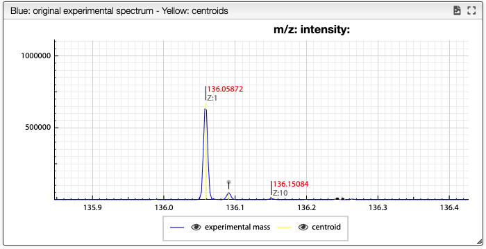
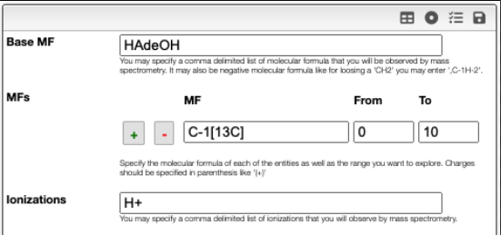

import MFFilter from '../includes/filter-mf.md'

# Mass spectra deconvolution

This tool allows to determine the exact composition based on a mass spectrum even if there are overlaps.

The workflow is the following:

- make a peak picking (centroids) of the mass spectrum
- generate all the theoretical isotopic distribution of all entities to look for
- align the theoretical isotopic distribution to the centroids
- calculate a non-negative matrix factorization
- create a report

## Peak picking

When loading the spectrum a peak picking is done that determine the position and width of all the peaks based on global spectrum deconvolution algorithm that was implemented in [javascript](https://github.com/mljs/global-spectral-deconvolution).

The result of the peak picking appears in the spectrum as yellow vertical lines. Note that the top of the peak is determined based on the 3 highest point and does not have to match an experimental point.

## Define possible MFs

When trying to deconvolute a mass spectrum it is required to define all the possible molecular formula. It is important to limit as much as possible the number of molecular formula to consider.

The molecular formula is defined based on:

- Base MF : atoms that are common and present in all the molecular formula
- Modifications: list of modifications that can be applied on the `Base MF`
  - if you want to search for isotopic enrichment you can enter as MF: `C-1[13C]`, a modification in which we remove a `C` of natural abundance and add a 13C
- Ionizations: define the list of ways to ionize the molecule. If the molecule is naturally charted this field may stay empty. It can also contain an unlimited comma separated list of ionizations like `Na+, K+, NH4+, H+,`. Note this comma at the end that allows also to have no ionizatioon.

<MFFilter />

## Mass spectrum parameters

Peak width calculation is done automatically and allows to predict the peak width based on the mass.

