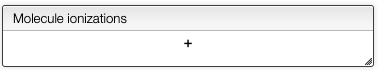
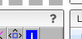
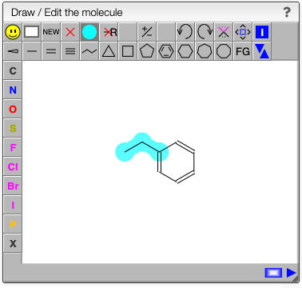
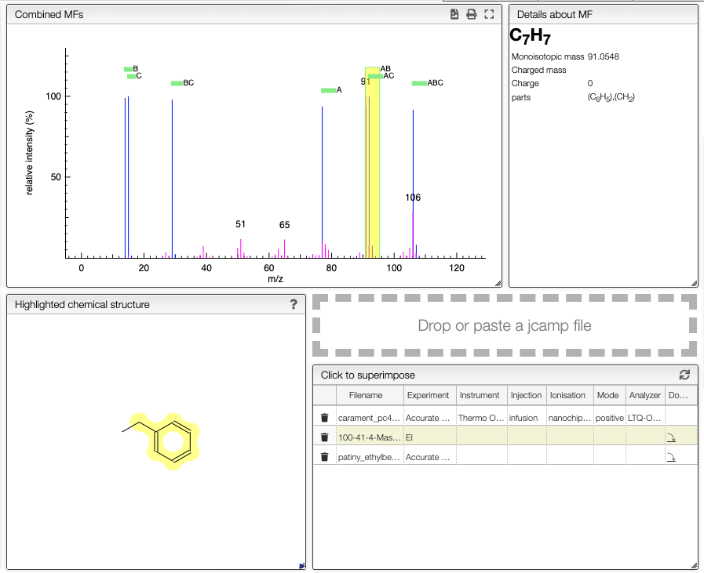
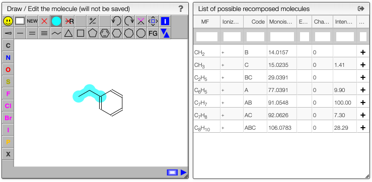
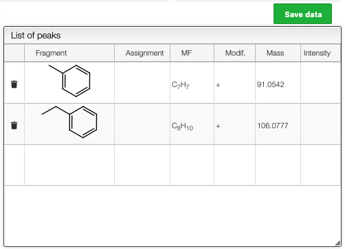

import JSMETip from '../../../../includes/jsme-tip.md'

# Mass fragmentation

## Simulation of mass fragmentation

Analysis of mass fragments of small molecules obtained for example by electronic impact may be cumbersome.

In order to facilitate the process, this tool allow to draw a molecule and select the breakable bonds. The system will then generate all the possible fragments and will recombine them.

### Select the ionization method

In order to observe a mass spectrum the molecule has to be charged and this ionization has an impact on the mass. You may enter a list of ionizations that was applied to the molecule in the following box:

For instance for electronic impact you would enter a simple ‘+’. Meaning that we have removed an electron to charge the molecule.

### Draw / edit the molecule

You may either draw a molecule directly in the editor or paste a molfile coming from another software. For instance if you have a molecule in ChemDraw™ you may select the molecule and ‘Edit -&gt; Copy as … -&gt; MOL Text’. Then you may put the mouse over the drawing applet and press ‘<kbd>CTRL</kdb> + V’ \(on windows\) or ⌘ + V’ on mac.

<JSMETip/>

### Define the cleavable bonds

In the drawing applet you should select the blue bullet icon and click on the bonds that are breakable.

The fragments with their corresponding mass will be calculated on the fly as well all the possible recombinations of those fragments. This may be useful to determine unknown side products of a reaction.

### Analyze the results

A virtual spectrum will all the possibility is generated and a mouse over the annotation over the peak will highlight the required parts of the molecules to reach the mass.

If you have a XY text file or jcamp containing an experimental spectrum you may directly drag and drop or paste on the drop zone.

You may also have mass spectra saved in the database and one click on the name will superimpose the spectrum to the predicted one.

## Assign fragments

The list of possible recomposed molecules also contains the intensity if there is an experimental spectrum.

For this list clicking to the '+' on a line will add this fragment in the list of peaks.

The same result can be achieved by pressing ALT + click on an annotation in the spectrum.

The list of assigned peaks can the be saved in the database by clicking on `Save data`.

