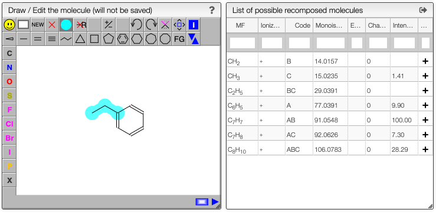
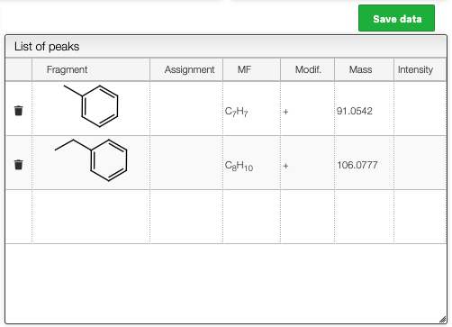

## Assign fragments

The list of possible recomposed molecules also contains the intensity if there is an experimental spectrum.

For this list clicking to the '+' on a line will add this fragment in the list of peaks.

The same result can be achieved by pressing ALT + click on an annotation in the spectrum.

The list of assigned peaks can the be saved in the database by clicking on `Save data`.

