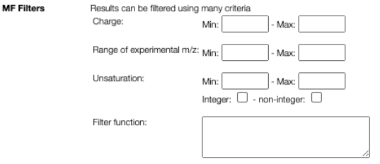

Possible MFs can be filtered based on DBE (double bond equivalent, unsaturation), charge and molecular weight. It is also possible to add more advanced filtering option by entering a javascript code that can use the following variables:

- mm: monoisotopic mass of the non ionized molecule
- mz: observed mass (m/z)
- charge: charge of the non ionized molecule
- unsaturation: unsaturation of the non ionized molecule
- atoms.O, atoms.C, atoms.N, ... number of atoms of the non ionized molecule
- examples:
  - atoms.O < atoms.C
  - mm < 500 && atoms.C > 10

