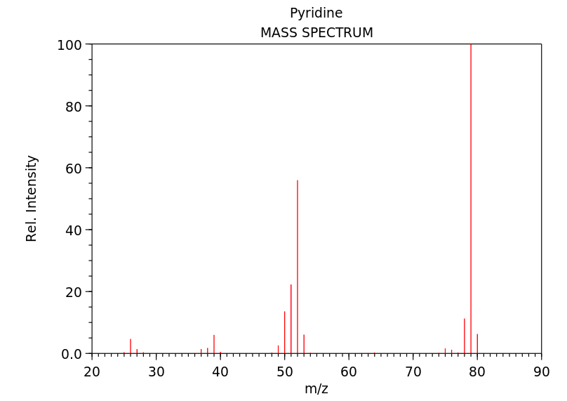

## Mass spectrometry 

https://en.wikipedia.org/wiki/Mass_spectrometry

Mass spectrometry (MS) is an analytical technique used to measure the mass-to-charge ratio of ions. It is widely used to identify unknown compounds, determine the isotopic composition of elements in a molecule and determine the structure of a compound by observing its fragmentation. The MS spectrum can be visualized in a graph of ion signal (%) with respect to the mass-to-charge ratio (m/z). In a typical MS procedure, the sample is ionized, then the ions are separated according to their mass-to-charge ratio and detected thanks to their charge, for example using an electron multiplier. 

