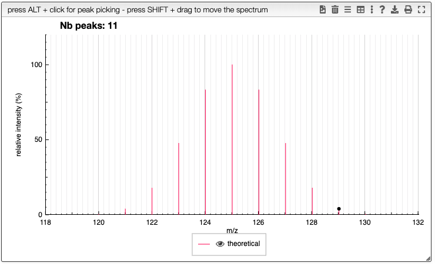
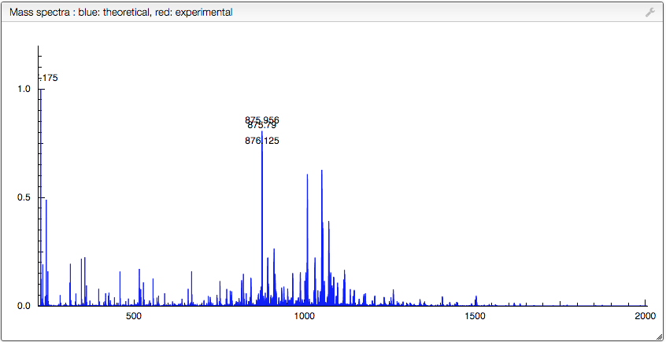

# Isotopic distribution from MF or chemical structure

This tool allows to calculate the theoretical distribution and monoisotopic mass from a MF, allowing predefined groups, chemical modification of amino acids, specification of a given isotope, and modification of the isotopic abundance.

Please use a recent version of Google Chrome.

## Molecular formula

### Use of any atom

You may use any of the stable elements.

### Salt

Atom groups can be separated by `.`.

Example: C100.C110.C120

### Predefined groups

Over 100 predefined groups like Et, Tos, Ala are defined in the system and can be used in a molecular formula.

### Use of specific isotope

Specific isotopes should be written in [].

Ex:[13C]50[12C]50 (molecule with 50 atoms of 13C and 50 atoms of 12C)

### Specify the isotopic abundance

Specific isotopic abundances should be written in {}.

Ex:

- C10C{50,50}10 (molecule with 10 atoms of natural abundance carbons and 10 atoms of enriched C (50% of 12C and 50% of 13C)
- C{50,50}10

### Specify the charges and atoms removal

Multiple charges can be specified by (+n) in which `n` is an integer.

H removal (H-1)

Ex: HAla10OH++; (H+)5; (H-5)(5-)

### Use of parenthesis

It is allowed to use any number of parenthesis

Ex: ((CH3)2CH)2NH

### Chemical modification of any predefined group

Any chemical modification can be written in () just after the predefined group

Ex:

- HSer(H-1Ph)OH : Serine modified with a Phenyl + H removal
- HCys(H-1C2H3O2)OH: Carbamidomethylated cysteine

## Pasting experimental data

Experimental data can be pasted and overlay with the calculated distribution (no similarity scores here). The data should be in a tab-delimited format, and you should simply copy / paste the data in the “Drop or paste zone” (first click somewhere outside this window to select the correct menu then paste in the window)

If the spectrum is loaded correctly it will immediately appear in the central window.

You can zoom in and out (double click) to look at specific overlay m/z ranges
