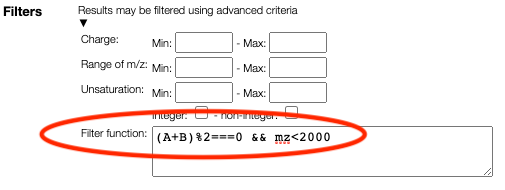

# Advanced filtering

Results may be filtered using a `javascript` syntax. The following variables are
available:

- A, B, C ... the number of monomers
- mm: theoretical monoisotopic mass
- mz: theoretical m/z (taking into account ionzation)
- unsaturation: degree of unsaturation
- charge: total charge
- atoms.C, atoms.O, ...: number of corresponding atoms

Based on those variables it is possible to write complex conditions:

- `(A+B)%2===0`: the sum of the number of A monomer and B monomer should be even
- `A<B`: the number of monomer A should be smaller than the number of monomer B
- `(A+B)>10 && atoms.N<5`: there should be at least 10 monomers and less than 5 nitrogens
