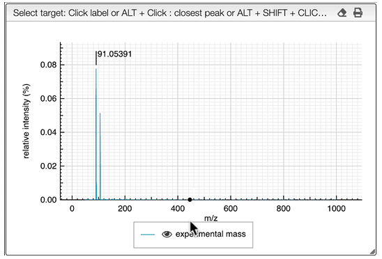

## Entering a monoisotopic mass

When loading an experimental spectrum the tool will automatically make a peak picking (centroid) that will be displayed on the spectrum.

Zooming in the spectrum will progressively add more and more detailed peaks.

If you are searching the molecular formula of an unknown product you should click on the label corresponding to the monoisotopic experimental mass.

