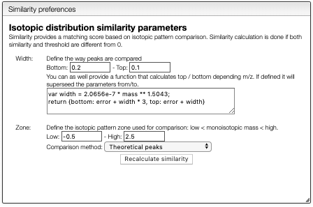
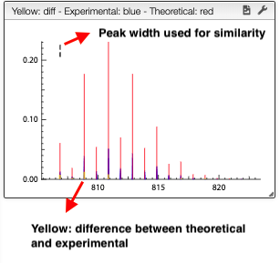

## Isotopic distribution similarity

Searching by monoisotopic allows quickly find possible molecular formula, but there are plenty of information in the isotopic distribution.

The tab `Similarity` will calculate the match between the predicted
and experimental isotopic distribution for the specified `Zone`.

Peak width will be calculated automatically based on the experimental spectrum and the formula is expected to be good. However, the similarity calculation depends on the mass precision and this parameter has to be setup correctly.

Clicking on one of the result will compare the theoretical versus the experimental isotopic distribution.

