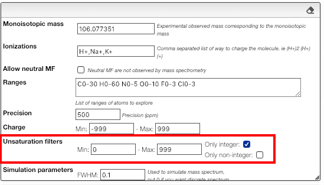

## Filter by unsaturation

This tools search for possible molecular formula based on:

- a monoisotopic experimental mass
- one or many ionization possibilities

The result can be further filtered by the <a href="https://en.wikipedia.org/wiki/Degree_of_unsaturation" target="_blank">degree of unsaturation</a>.

For stable molecules the unsaturation degree is expected to be greater or equal to zero.
Moreover, if it is non-radical molecule the unsaturation degree is integer.

Please note that those filters apply on the molecular formula without the ionization.
